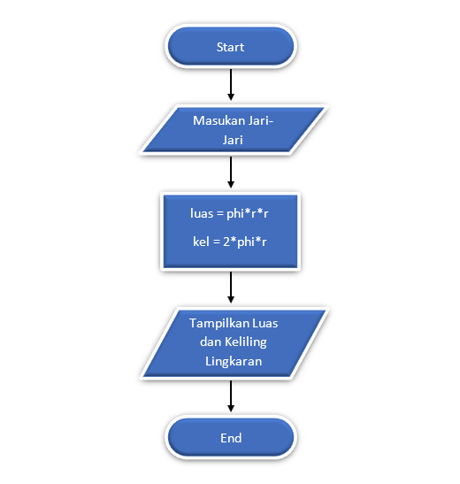
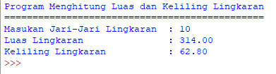

# Latihan 3
## Menghitung Luas & Keliling Lingkaran

<p align="center">
 
</p>

## Rumus

```bash
Luas     = π × r × r
Keliling = 2 × π × r
```

<p>Phi adalah sebuah konstanta dalam matematika yang merupakan perbandingan keliling lingkaran dengan diameternya. phi juga memiliki nilai 3,14 atau 22/7. namun program ini saya buat menggunakan nilai 3,14
</p>

## Flowchart 



## Program

```bash
print("Program Menghitung Luas dan Keliling Lingkaran")
print("==============================================")
r = float(input("Masukan Jari-Jari Lingkaran  : "))

phi = 3.14
luas = phi*r*r
kel = 2*phi*r

print ("Luas Lingkaran :",format(luas,'.2f'))
print ("Keliling Lingkaran :",format(kel,'.2f'))
```

## Penjelasan

<p>Pertama, kita akan mendeklarasikan variable r serta memasukkan nilai jari-jari lingkaran bertipe float, lalu membuat variable phi dengan nilai 3.14 dan mendeklarasikan variable luas dimana nilai variable phi dikali nilai variable r lalu dikalikan lagi dengan variable r dan hasilnya akan dimasukkan kedalam variable luas.

Begitu juga dengan variable kel (keliling), namun variable ini memiliki rumus yang berbeda yaitu 2 dikali variable phi dan dikali nilai variable r yang hasilnya dimasukkan kedalam variable kel dan yang terakhir menampilkan nilai dari variable luas dan kel (keliling)</p>

### Ouput



### TERIMA KASIH